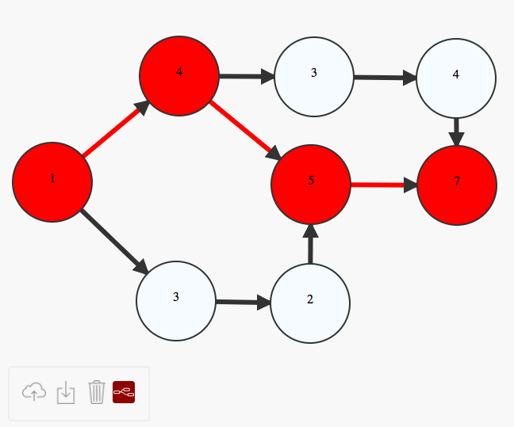

Graph Editor Express
====================

Interactive tool for creating directed graphs, created using d3.js.
It also lets you calculate the shortest path between two nodes when all the nodes
have an integer label.



## Operations:

* Drag & Scroll to translate / zoom the graph
* Click on the graph to create a node
* Ctrl-click on a node and then drag to another node to connect them with a directed edge
* Ctrl-click on a node to change its title
* Click on node or edge and press backspace/delete to delete

## Dijkstra

When all nodes contain an integer value then the Dijkstra-enabled icon will turn on (). This means that the graph is elegible for calculating a path using Dijkstra's algorithm.

In order to calculate such path you need to:

1. Select a node. (Node will turn light pink)
2. Right-click on it and select "From Node". (The node itself turns to red)
3. Select another node. (Node will turn light pink)
4. Right-click on it and select "To Node". (The node itself turns to red)

The shortest path will automatically be calculated using Dijkstra's algorithm. All nodes belonging to the shortest path will
be painted to red together with the corresponding edges.

If no possible path can be found between the selected nodes a message will pop-up.

You can, at any time, change the "From" and "To" nodes and the shortest path will be recalculated.

If you want to clear the path, just click the  icon.

## How to use it?

Run a simple http server using python:

  ```
  python -m SimpleHTTPServer 8000`
  ```

Then navigate to: ```http://localhost:8000```

## License
MIT/X
